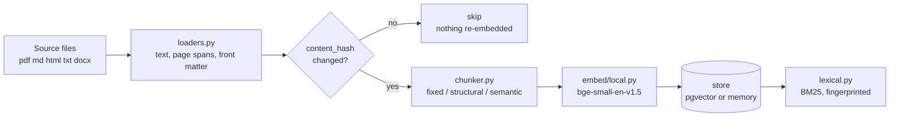
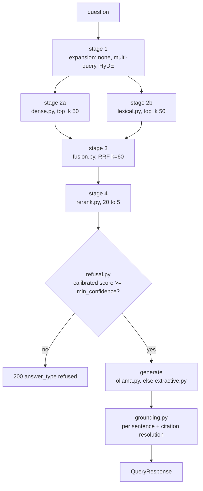

# Architecture

How the pieces fit, and why the boundaries fall where they do. For the measured comparison
between retrieval configurations see [evaluation.md](evaluation.md) and `eval_results/`; no
numbers are quoted here.

## The two paths

Ingestion and querying are separate flows that meet only at the vector store and the BM25
index. Nothing in the query path can write, and nothing in the ingestion path knows a query
exists.





Stages 2a and 2b run concurrently under `asyncio.gather`. The refusal decision happens
before generation, so a weak question costs no forward pass and the refusal cannot be argued
out of by a fluent model.

## Module map

| Package | Owns | Boundary reason |
|---|---|---|
| `config.py` | Settings, seeding, event loop policy | One place that reads the environment, so nothing else has to |
| `models.py` | Every Pydantic schema and enum | The contract between stages is explicit rather than implied by keyword arguments |
| `errors.py` | Typed errors with a `code` and `http_status` | Lets the API have exactly one exception handler |
| `ingest/` | Loading, chunking, the orchestrated pipeline | Everything that turns files into stored chunks |
| `embed/` | `Embedder` and `Tokenizer` protocols, local and remote | The protocol is what lets the whole suite run on a fake |
| `store/` | `VectorStore` protocol, memory and pgvector backends | Two implementations of one contract, with shared guards |
| `retrieve/` | Dense, lexical, fusion, rerank, orchestration | Each stage is separately testable and separately toggleable |
| `generate/` | LLM protocol, prompts, Ollama, extractive fallback | Generation is swappable without touching the guarantees around it |
| `guardrails/` | Grounding verification, refusal policy | The checks live outside generation so they cannot be skipped by it |
| `service.py` | `AnswerService`, the answer path | Outside `api/` on purpose, see below |
| `api/` | Routes, middleware, the service graph | Thin. Translates HTTP to service calls and back |
| `eval/` | Metrics, golden-set validation, runner, reporting | Depends on `service.py`, never on `api/` |

The one boundary worth defending explicitly is `service.py`. The answer path lives there
rather than in a route handler because the evaluation harness has to measure the same
sequence the API serves. If the orchestration lived in `api/`, the harness would either
import the web layer or reimplement it, and a reimplementation drifts. The published numbers
would then describe a code path no user ever hits.

## Data model

```
Document ──chunker──> Chunk ──embedder──> EmbeddedChunk ──store──> SearchHit
                                                                      │
                                                            ScoredChunk (+ StageScores)
```

| Type | Carries | Note |
|---|---|---|
| `Document` | text, `content_hash`, `media_type`, metadata, `page_spans` | Offsets are into `text`, after front matter is stripped and line endings normalised |
| `Chunk` | text, `start_char`, `end_char`, `token_count`, `section_path`, `page_number`, strategy | Enough provenance to cite it without re-reading the source |
| `EmbeddedChunk` | a chunk plus its vector | The unit a store persists |
| `ScoredChunk` | a chunk, its final score, and `StageScores` | `StageScores` keeps the per-stage score and rank, so rank movement is inspectable |
| `RetrievalResult` | chunks, expanded queries, candidate counts, timings, the exact config | The config travels with the result so a number is always attributable |

### Why chunk ids are deterministic

`chunk_id = UUID5(namespace, f"{doc_id}:{start_char}")`.

Re-ingesting an unchanged document therefore produces byte-identical ids. That is what lets
content-hash change detection and upsert coexist: the pipeline can skip a document entirely,
and when it does re-ingest one, the new chunks replace the old ones by id rather than
accumulating beside them. A random id would make every re-ingest a full rewrite and would
make "0 changed" impossible to assert.

Two chunks of one document must never share a `start_char`, or their ids would collide. That
is asserted in the chunker tests.

## Where the interesting failures are handled

**A dead model server.** `OllamaLLM` raises `LLMUnavailableError`; `AnswerService._generate`
catches it and falls back to `ExtractiveAnswerer`. An empty completion is treated the same
way, because a blank answer with a confident shape is a failure that did not raise. Readiness
reports `generator: false` but stays `ready: true`, since a stopped model server is a quality
reduction rather than an outage.

**A mixed embedding space.** `store/base.py:check_embedding_space` refuses vectors whose
embedder name or dimension differs from what the collection recorded at creation. Mixing two
embedding spaces is invisible until recall craters, so it is a hard error. The guard is
implemented once and called by both backends, because a guard only one store applies makes
the bug backend-dependent.

**A stale BM25 index.** Staleness is a SHA256 fingerprint over the sorted chunk-id list, so a
re-ingest producing the same chunks does not force a rebuild while a single added chunk does.
The persisted index is keyed by chunk id and re-aligned on load, because ingestion is
concurrent and chunk order genuinely varies between runs; a positional list would pair chunks
with other chunks' tokens.

**Tokenizer thread safety.** The HuggingFace fast tokenizer is a Rust object that raises
"Already borrowed" when two threads use it at once, and encoding runs in a worker thread
while the chunker tokenizes on the event loop thread. `LocalEmbedder` shares one lock between
its tokenizer wrapper and its encode path.

**An uncalibrated confidence.** `RefusalPolicy` thresholds the cross-encoder's score only.
A fused RRF score is around 0.03 by construction, so thresholding it at 0.3 would refuse
every query in the no-rerank configurations. When no calibrated score exists the check is
skipped and the decision records `threshold_applied: false`.

**Windows and psycopg.** `configure_event_loop()` selects the selector event loop policy,
because psycopg's async pool cannot run on Windows' default ProactorEventLoop and fails with
a pool timeout that names nothing useful. A no-op on Linux, where the containers run.

## Request lifecycle

1. `observe_and_limit` middleware checks the token bucket, then times the request. Health and
   metrics paths are exempt, because a limiter that can starve the liveness probe removes a
   healthy service from rotation under exactly the load it was meant to survive.
2. `request_context` middleware takes an inbound `X-Request-ID` or mints one, stores it on
   `request.state`, and binds it to a structlog contextvar. A log line emitted deep inside
   retrieval then carries the id without it being threaded through every signature.
3. The route resolves per-request config overrides against the frozen default, producing a
   copy rather than mutating shared state.
4. `AnswerService.answer` retrieves, decides whether to answer, generates, and verifies.
5. The response is Pydantic-validated on the way out; the request id is in both the body and
   the response header.
6. Any `RetrievalEngineError` is turned into one error envelope by a single handler, using the
   error's own declared code and status. Unexpected exceptions log a traceback and return a
   generic message, because the request id is enough to find the detail without leaking
   internals to the caller.
